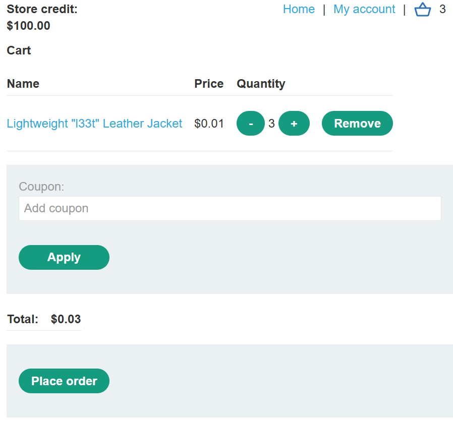

# Excessive-Trust-in-Client-Side-Controls
Parameter Tampering / Excessive Trust in Client-Side Controls
Category: Business Logic Vulnerabilities
Platform: PortSwigger Web Security Academy
1. Executive Summary
The application’s purchasing workflow relied on the client to provide the price of an item during the checkout process. By intercepting the HTTP request and modifying the price parameter before it reached the server, I was able to purchase a high-value item (Lightweight "l33t" Leather Jacket) for an arbitrary price of $0.01. This demonstrates a failure to validate data integrity on the server side.
________________________________________
2. Vulnerability Description
Vulnerability Name: Parameter Tampering / Excessive Trust in Client-Side Controls
Risk Rating: Critical (In a production environment, this leads to direct financial loss).
The application assumes that because the price is correctly displayed in the UI, the price submitted in the background request is also correct. However, any data originating from the client (the browser) can be manipulated by a user using a proxy tool like Burp Suite.
________________________________________
3. Technical Walkthrough
Phase 1: Reconnaissance
•	Action: Logged into the application using provided credentials (wiener:peter).
•	Observation: Browsed the product catalog and identified the target item: the "Lightweight l33t leather jacket" priced at $1337.00.
Phase 2: Interception
•	Action: Added the jacket to the cart while running Burp Suite Proxy.
•	Analysis: I examined the POST request sent to /cart. The request body contained several parameters:
o	productId: 1
o	quantity: 3
o	price: 133700 (in cents)

Phase 3: Exploitation
1.	In Burp Suite, I sent the /cart POST request to the Repeater.
2.	I modified the price parameter value from 133700 to 1.
3.	I forwarded the modified request to the server.
4.	The server accepted the request and added the item to the cart with the forged price.
Phase 4: Verification
•	Action: Navigated to the cart page and clicked "Place Order."
•	Result: The order was processed successfully. The system confirmed the purchase of the $1,337 jacket for a total of $0.03.
________________________________________
4. Root Cause Analysis
The application follows a dangerous "trust-by-default" pattern. It retrieves the price from a hidden field or a JavaScript variable in the browser and sends it to the server. The server then uses this client-provided price to calculate the final total instead of querying its own authoritative database for the correct price of productId: 1.
________________________________________
5. Remediation Recommendations
•	Never trust client-side input for sensitive data: The server should only receive the productId and quantity.
•	Server-Side Lookup: The application should look up the price of the item in its own backend database based on the productId provided.
•	Integrity Checks: If the price must be sent from the client (rarely recommended), it should be protected by a cryptographic hash (MAC) that the server verifies to ensure the value hasn't been tampered with.
________________________________________
6. Tools Used
•	Browser: Firefox (FoxyProxy)
•	Proxy: Burp Suite Professional/Community Edition (Intercept, Repeater)

